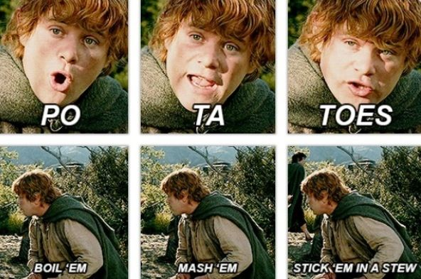
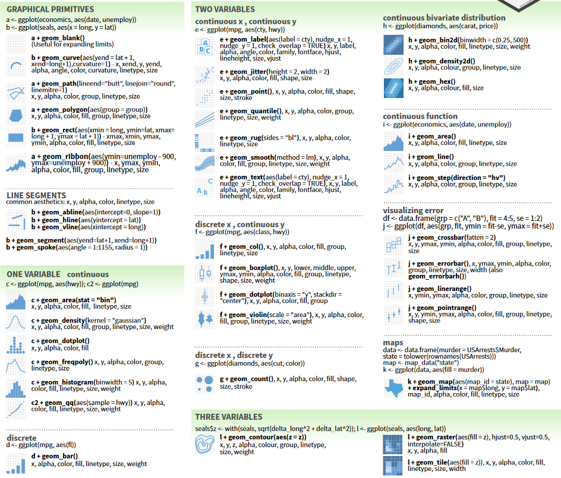

```{r setup, include=FALSE, purl=FALSE}
knitr::opts_chunk$set(echo = TRUE)
options(knitr.duplicate.label = "allow")
knitr::purl("./tidy_overview.Rmd", output = "R/tidy_overview.R")
```

## While we wait...

1. Install R from [cran.r-project.org](cran.r-project.org)
2. Install Rstudio from [rstudio.com](rstudio.com)
3. Install the tidyverse with this R command: `install.packages("tidyverse")`
4. If you'd like to follow along, get the slides (.html) and/or code (.R): [github.com/andrewGhazi/tidy_overview](github.com/andrewGhazi/tidy_overview)

## What is the tidyverse?

<div class="columns-2">
- A dialect of R
- A collection of R packages with a shared design philosophy
<br/><br/><br/>
- Install it with this R command: `install.packages("tidyverse")`

```{r echo=FALSE,  out.width="95%", purl=FALSE}
knitr::include_graphics('images/tidyverse-logo.png')
```
</div>

## Why use the tidyverse?

- Shared design philosophy → inter-package consistency
- Focused on data science and statistical analysis
- Easy to learn, write, and read
- It's ubiquitous

```{r out.width="80%", echo = FALSE, purl=FALSE, fig.cap="Diagram from R for Data Science by Wickham et al."}
knitr::include_graphics("images/data-science.png")
```

## Outline

<div class="columns-2">
* Core concepts
* Package overview
* End-to-end example
* Questions


<br/><br/><br/><br/>

```{r echo = FALSE, out.width="100%", purl=FALSE}

```
</div>

## How to read these slides

- Lecture notes show up like this.

```{r}
print("Console output has two pound symbols in front.")
x = 5 
```
- Assignment prints nothing.
- `package::function()` e.g. `dplyr::filter()`

## Load the tidyverse

The startup message lists loaded packages and overwritten functions.

```{r}
library(tidyverse)
```

# Core concepts

## Data frames

- Used to store ordered collections of variables

```{r message = FALSE, echo = FALSE}
data_path = "data/diabetes.tsv"
diabetes = read_tsv(data_path)
```
```{r}
diabetes
```

## tidy data

- Columns are variables
- Rows are observations

```{r echo = FALSE}
diabetes
```

## tidyverse functions

- data frame in, data frame out
- Function names are *verbs*
  - e.g. `filter`, `arrange`, `mutate`


## Pipes

* Pipes look like this: `%>%`

* They take the input from the left side, and hand it to the right side:

```{r}
c(1,2,3,4) %>% mean
```

* Verbalize as: "and then".

* "Create this vector and then take the mean".

## Pipe example

Why are pipes useful? 

## Pipe example

Why are pipes useful?

```{r echo = FALSE, out.width="75%", purl=FALSE}

```

## Pipe example

Why are pipes useful?

```{r echo = FALSE, out.width="75%", purl=FALSE}

```

## Pipe example
```{r echo = FALSE}
boil = function(x) paste('boiled', x)
mash = function(x) paste('mashed,', x)
stick = function(x, where) paste(where, 'ed, ', x, sep = '')
```

Compare two ways of doing the same thing:
```{r}
input = "potatoes"

stick(mash(boil(input)), where = 'stew')
```

## Pipe example

Compare two ways of doing the same thing:
```{r}
input = "potatoes"

stick(mash(boil(input)), where = 'stew')

input %>% boil() %>% mash() %>% stick(where = 'stew')
```

## Pipe example

Why are pipes useful?

Because chained verbs look like English sentences.

```{r eval = FALSE}
input %>% 
  boil() %>% 
  mash() %>% 
  stick(where = 'stew')
```

- Piped code is easier to write *and easier to read*.
- Keyboard shortcut: `ctrl + shift + M`

# package overview 

## Import - `readr`

<div class="columns-2">
- Get the data into R as a data frame.
- Read data from a file on your computer or from a URL
- `read_csv()`, `read_tsv()`
- related package: `readxl`
- Read in the diabetes example dataset:

```{r message = FALSE}
data_path = "data/diabetes.tsv"
diabetes = read_tsv(data_path)
```
```{r echo = FALSE, out.width="90%", purl=FALSE}
knitr::include_graphics('images/readr.png')
```


```{r echo = FALSE, eval = FALSE}
# this is how you prepare the diabetes dataset
library(MASS)
diabetes = rbind(Pima.tr, Pima.te) %>% 
  as_tibble %>% 
  dplyr::rename(diabetic = type)
write_tsv(diabetes, 'C:/Users/aghazi/tidy_overview/data/diabetes.tsv')
write_tsv(diabetes, 'data/diabetes.tsv')
# This is rbind(Pima.tr, Pima.te) using the two datasets from the R package MASS (not a tidyverse package)
```
</div>

## Manipulate - `dplyr`

<div class="columns-2">
- Package for basic data manipulation
- Most important functions: `filter()`, `select()`, `arrange()`, `mutate()`, `group_by()`, `summarise()`
- Focused on data frames

```{r echo=FALSE, out.height="95%", out.width="95%", purl=FALSE}
knitr::include_graphics('images/dplyr_logo.png')
```
</div>

## `dplyr::filter()`

- Subset rows by a condition

```{r}
diabetes %>% 
  filter(npreg == 0)
```

## `dplyr::filter()`

- Subset rows by a condition

```{r}
diabetes %>% 
  filter(bmi > 30)
```

## `dplyr::select()`

- Subset columns
- Choose columns by name, index, or condition

```{r}
diabetes %>% 
  select(diabetic, npreg, age)
```

## `dplyr::select()`

- Subset columns
- Choose columns by name, index, or condition

```{r}
diabetes %>% 
  select(8, 1, 7)
```

## `dplyr::select()`

- Subset columns
- Choose columns by name, index, or condition

```{r}
diabetes %>% 
  select(starts_with('b'), matches('diab'))
```

## `dplyr::arrange()`

- Reorder rows by a variable

```{r}
diabetes %>% arrange(bmi)
```

## `dplyr::arrange()`

- Reorder rows by a variable

```{r}
diabetes %>% arrange(desc(age))
```

Quiz: What's the highest blood pressure observed in this data? (hint: desc())

## `dplyr::mutate()`

- Add new columns
- Structure: 
```{r eval = FALSE}
input_df %>% 
  mutate(col_name = col_values)
```

## `dplyr::mutate()`

- Add new columns
- Example: add an index
```{r}
diabetes %>% 
  mutate(index = 1:532)
```

## `dplyr::mutate()`

- Refer to other columns by name
- Example: Calculate birth year as a function of age
```{r}
diabetes %>% 
  mutate(birth_year = 2021 - age)
```

## `dplyr::mutate()`

- Add new columns
- Example: Calculate birth year as a function of age
```{r}
diabetes %>% 
  mutate(birth_year = 2021 - age,
         is_mother = npreg > 0)
```

## `dplyr::group_by()`

- Group a data frame
- Example: diabetic vs non-diabetic:

```{r}
diabetes %>% 
  group_by(diabetic)
```

## `dplyr::summarise()`

- Compute summary values by group

```{r}
diabetes %>% 
  group_by(diabetic) %>% 
  summarise(mean_age = mean(age))
```

## `dplyr::summarise()`

- Compute summary values by group

```{r}
diabetes %>% 
  group_by(diabetic) %>% 
  summarise(mean_age = mean(age),
            group_size = n())
```

## `dplyr::summarise()`

- You can group by multiple variables

```{r}
diabetes %>% 
  mutate(is_mother = npreg > 0) %>% 
  group_by(diabetic, is_mother) 
```

## `dplyr::summarise()`

- You can group by multiple variables

```{r}
diabetes %>% 
  mutate(is_mother = npreg > 0) %>% 
  group_by(diabetic, is_mother) %>% 
  summarise(mean_age = mean(age))
```

## Visualize - `ggplot2`
<div class="columns-2">
- "Grammar of graphics"
- Core concepts:
  - Variables from tidy input data
  - Aesthetic mappings between variables and graphical elements: `aes()`
  - Add geometric objects to represent data via `geom_*()` e.g. `geom_point()`
  
```{r echo = FALSE, out.width = "80%", purl=FALSE}
knitr::include_graphics("images/ggplot2.png")
```
  
</div>

## Visualize - `ggplot2` example

- Tidy input, aesthetic mapping, and a geom
```{r fig.height=3.2}
diabetes %>% 
  ggplot(mapping = aes(x = age, y = bp)) + 
  geom_point()
```

## Visualize - `ggplot2` example
```{r fig.height=3.1}
diabetes %>% 
  mutate(is_mother = npreg > 0) %>% 
  ggplot(aes(is_mother, age)) + 
  geom_boxplot()
```

## Visualize - `ggplot2`'s suite of geoms
```{r echo = FALSE, out.width='75%', fig.align='center'}

```

## Report - `rmarkdown`
<div class="columns-2">
- Communicate analysis results
- Easily interweave notes, code, plots, and $\LaTeX$ in a single file
- Render as reports (.docx, .pdf, .html), slides (.html, .ppt), or web applications (Shiny)
- Rmd + Github = Digital lab notebook
- Demonstration at end of session 1 if there's time

```{r echo = FALSE, out.width="90%", purl=FALSE}
knitr::include_graphics("images/rmd.png")
```

</div>

# COVID-19 example

## COVID-19 data

* New York Times COVID-19 data on Github
* https://github.com/nytimes/covid-19-data
* Provides COVID-19 data by county, state, and nation-wide

## Example: US COVID-19 state-level data

```{r cache=TRUE}
nyt_url = "https://raw.githubusercontent.com/nytimes/covid-19-data/master/us-states.csv"
state_covid = read_csv(nyt_url)
```

## Example: Import state-level COVID-19 data

- Look at the data

```{r}
state_covid
```

## Example: COVID-19 in California

- Plot one state over time

```{r eval = FALSE}
state_covid %>% 
  filter(state == "California") %>% 
  ggplot(aes(date, deaths)) +
  geom_line()
```

- What will the output of this command look like?

## Example: COVID-19 in California

- Plot one state over time

```{r out.width="50%"}
state_covid %>% 
  filter(state == "California") %>% 
  ggplot(aes(date, deaths)) +
  geom_line()
```

## Example: COVID-19 in California

- Want to define the CHANGE in deaths
```{r}
state_covid %>% 
  filter(state == "California", deaths > 0) 
```

## Example: COVID-19 in California

- Define daily added deaths using `diff()`
```{r eval=FALSE}
state_covid %>% 
  filter(state == "California") %>% 
  mutate(new_deaths = diff(deaths))
```
## That didn't work

- Define daily added deaths using `diff()`
```{r error=TRUE}
state_covid %>% 
  filter(state == "California") %>% 
  mutate(new_deaths = diff(deaths))
```

## The fix

- `diff()` returns a vector that's one element too short -- tack on the first observation at the start.

```{r}
state_covid %>% 
  filter(state == "California") %>% 
  mutate(new_deaths = c(deaths[1], diff(deaths))) 
```


## Example: New deaths over time

```{r fig.height=3}
state_covid %>% 
  filter(state == "California") %>% 
  mutate(new_deaths = c(deaths[1], diff(deaths))) %>% 
  ggplot(aes(date, new_deaths)) +
  geom_point() 
```

## Example: Adding bells and whistles to a plot

```{r eval = FALSE}
state_covid %>% 
  filter(state == "California") %>% 
  mutate(new_deaths = c(deaths[1], diff(deaths))) %>% 
  ggplot(aes(date, new_deaths)) +
  geom_point() + 
  geom_smooth(method = "loess", span = .2) + 
  labs(title = "Daily new deaths in California",
       y = "New Deaths",
       caption = "Data from the New York Times: https://github.com/nytimes/covid-19-data") + 
  theme_bw()
```


## Example: COVID-19 in California

```{r echo = FALSE, message = FALSE, warning = FALSE, out.width="90%"}
state_covid %>% 
  filter(state == "California") %>% 
  mutate(new_deaths = c(deaths[1], diff(deaths))) %>% 
  ggplot(aes(date, new_deaths)) +
  geom_point() + 
  geom_smooth(method = "loess", span = .2) + 
  labs(title = "Daily new deaths in California",
       y = "New Deaths",
       caption = "Data from the New York Times: https://github.com/nytimes/covid-19-data") + 
  theme_bw()
```

- Further enhancement with a trendline, labels, and theme
- Try plotting several states with different colors (hints: use `%in%` and `aes(color = ...)`)

## Example: US COVID-19

- What states had the highest daily new deaths?

## Example: US COVID-19

- What states had the highest daily new deaths?
- What do we need to do?

## Example: US COVID-19

- What was the highest daily increase in death in any state?

```{r}
state_covid %>% 
  group_by(state) %>% 
  mutate(new_deaths = c(deaths[1], diff(deaths))) %>% 
  summarise(state_max = max(new_deaths)) %>% 
  arrange(desc(state_max))
```

- Note: `mutate()` is aware of groups!

# Before switching to RStudio...

## How to get help

- To look at the documentation for any function, use `?` or `help()`
  - `?summarise`
  - How to read help: https://socviz.co/appendix.html#a-little-more-about-r
- Package-specific walkthroughs: `vignette(package = "dplyr")`
- [R tag on Stats Stack Exchange - stats.stackexchange.com](https://stats.stackexchange.com/questions/tagged/r)

## Resources

- [R for Data Science - https://r4ds.had.co.nz/](https://r4ds.had.co.nz/)
- [Cheat Sheets - https://rstudio.com/resources/cheatsheets/](https://rstudio.com/resources/cheatsheets/)
- [Tidy Tuesday - Weekly analysis screencasts](https://github.com/rfordatascience/tidytuesday) [on youtube](https://www.youtube.com/playlist?list=PL19ev-r1GBwkuyiwnxoHTRC8TTqP8OEi8)

# Questions?

# Day 2

## `purrr`

- Functional programming

## `map()`

- Apply a function to each element of a list
- Example:

```{r}
map(1:3, sqrt)
```
## `map()`

- Apply a function to each element of a list
- Example:

```{r}
map(1:3, sqrt)
```
```{r eval = FALSE}
map(datasets, ml_algorithm)
```

## Anonymous functions

- Tilde + `.x`
- Use to easily define single-use functions


## `map_*()` variants

- `map()` always returns a list
- Variants return a vector of a specific type

```{r}
map_dbl(1:5, ~.x^2 + 1)
map_lgl(1:5, ~.x == 3)
map_chr(letters[1:5], ~paste0(rep(.x, 3), collapse=''))
```

## purrr example: run many models

- Define each combination of two explanatory variables

```{r}
formula_df = names(diabetes)[1:7] %>% 
  combn(m = 2) %>% 
  t %>% 
  as_tibble %>% 
  set_names(c('x1', 'x2')) %>% 
  mutate(formula = paste("diabetic ~ ", x1, " + ", x2, sep = ''))
formula_df
```

## purrr example: run many models

- Run a logistic regression on each combination of explanatory variables

```{r eval = FALSE}
formula_df %>% 
  mutate(glm_result = map(formula,
                          ~glm(.x, data = diabetes, family = 'binomial'))) 
```

## purrr example: run many models

- Extract the AIC of each model fit

```{r eval = FALSE}
formula_df %>% 
  mutate(glm_result = map(formula,
                          ~glm(.x, data = diabetes, family = 'binomial')),
         aic = map_dbl(lm_result,
                       ~.x$aic)) 
```

## purrr example: run many models

- See which model had the lowest AIC

```{r eval = FALSE}
formula_df %>% 
  mutate(glm_result = map(formula,
                          ~glm(.x, data = diabetes, family = 'binomial')),
         aic = map_dbl(lm_result,
                       ~.x$aic)) %>% 
  arrange(aic)
```

## Organize - `tidyr`

- `pivot_longer()` and `pivot_wider()`
- `separate()` and `unite()`

## Data tidying example: WHO TB data

* WHO tuberculosis case data
* realistically messy!
* Try running these commands:

```{r eval = FALSE}
?tidyr::who
dim(who)
names(who)
who[1:5, 1:8]
who
```

* We will tidy this data in 5 steps

## WHO TB column names

* First part: "new" or "old"
* Second part: TB type (relapse, extrapulmonary, smear-positive, smear-negative)
* Third part: Sex and age group (e.g. f2534)

## TB tidying 1/5: pivot wide to long

```{r}
who1 = who %>% 
  pivot_longer(new_sp_m014:newrel_f65, 
               names_to = "key", 
               values_to = "values", 
               values_drop_na = TRUE)
who1
```

## TB tidying 2/5: fix inconsistent names
```{r}
who2 = who1 %>% 
  mutate(key = str_replace(key, "newrel", "new_rel"))
who2
```

## TB tidying 3/5: separate identifier components

```{r}
who3 = who2 %>% 
  separate(key, into = c("newold", "tb_type", "sexage"))
```

## TB tidying 4/5: separate sex and age group

```{r}
who4 = who3 %>% 
  separate(sexage, into = c("sex", "age_group"), sep = 1)
```

## TB tidying 5/5: remove redundant columns

```{r}
who_final = who4 %>% 
  select(-newold, -matches("iso"))
```


## TB tidying: Final command

```{r}
tidyr::who %>% 
  pivot_longer(new_sp_m014:newrel_f65, 
               names_to = "key", 
               values_to = "values", 
               values_drop_na = TRUE) %>%
  mutate(key = str_replace(key, "newrel", "new_rel")) %>%
  separate(key, into = c("newold", "tb_type", "sexage")) %>% 
  separate(sexage, into = c("sex", "age_group"), sep = 1) %>% 
  select(-newold, -matches("iso"))
```

## Joins if there's time


## Everything else

- `forcats   ` - work with factors
- `stringr   ` - work with strings
- `lubridate ` - work with dates
- `tidymodels` - work with stats/ML algorithms
- `reticulate` - work with Python

## How to get help

- To look at the documentation for any function, use `?` or `help()`
  - How to read help: https://socviz.co/appendix.html#a-little-more-about-r
- Package-specific walkthroughs:`vignette(package = "dplyr")`
- [R tag on Stats Stack Exchange - stats.stackexchange.com](https://stats.stackexchange.com/questions/tagged/r)

## Resources

- [R for Data Science - https://r4ds.had.co.nz/](https://r4ds.had.co.nz/)
- [Cheat Sheets - https://rstudio.com/resources/cheatsheets/](https://rstudio.com/resources/cheatsheets/)
- [Helpful cartoons - https://github.com/allisonhorst/stats-illustrations](https://github.com/allisonhorst/stats-illustrations)
- [Tidy Tuesday - Weekly analysis screencasts](https://github.com/rfordatascience/tidytuesday) [on youtube](https://www.youtube.com/playlist?list=PL19ev-r1GBwkuyiwnxoHTRC8TTqP8OEi8)


